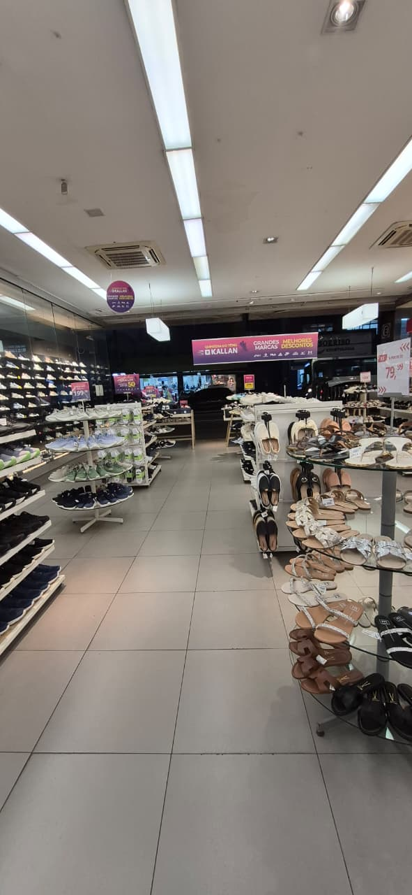
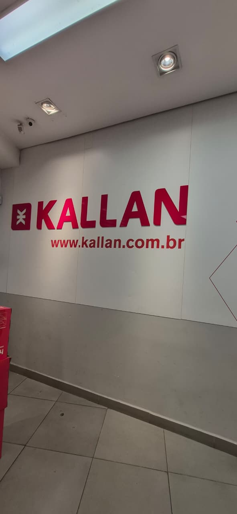

# Projeto Kallan — Desenvolvimento Front-End para Web

## Integrantes

- Guilherme Jussek Nogueira — RGM: 47392657
- Henry Soave Bailer — RGM: 46977244
- Matheus Augusto Assunção Novaes — RGM: 47714638
- Nicolas Gabriel Parris Reis — RGM: 47646691
- Sander Lima Alves — RGM: 47673621

## Introdução

Projeto acadêmico desenvolvido para a disciplina de Desenvolvimento Front-End para Web, utilizando a Kallan Calçados como organização real de referência.

O objetivo do projeto é desenvolver uma experiência web estruturada em HTML5, com navegação entre as páginas, organização semântica, formulários, recursos multimídia e estrutura preparada para a evolução visual na Entrega 2.

### Contato com a organização real

O contato com a organização foi realizado presencialmente pelo integrante Sander Lima Alves, que trabalha na unidade Kallan K44. Durante o contato, foi obtida autorização da gestão para a utilização do nome e do logotipo da unidade para fins acadêmicos, relacionados ao desenvolvimento deste projeto.

### Comprovação do contato

Como complemento à comprovação do contato presencial com a unidade Kallan K44, foram adicionadas à pasta `docs/` três fotos relacionadas à unidade, mostrando o interior da loja e a identificação da marca.






### Processo de desenvolvimento

O projeto foi estruturado utilizando HTML5 semântico. A estrutura principal é composta por uma página inicial, páginas de contato e orçamento e sete páginas de conteúdo.

A maior parte do desenvolvimento foi realizada em um único computador na faculdade, utilizando o Visual Studio Code. Durante o processo, o grupo trabalhou em conjunto, discutindo as ideias, dividindo tarefas e realizando alterações e testes no projeto.

Cada integrante contribuiu em diferentes etapas, pensando em ideias, conteúdo, testes, revisão e outras atividades necessárias.

Também utilizamos o Git e o GitHub para organizar as versões do projeto e acompanhar as alterações realizadas durante o desenvolvimento.

Foram implementados formulários com validação nativa do HTML5, recursos de áudio e vídeo e navegação consistente entre as páginas.

Os formulários de contato e orçamento utilizam o Netlify Forms para o recebimento das informações enviadas pelos usuários.

### Desafios técnicos

Durante o desenvolvimento, tivemos alguns desafios, principalmente para organizar a navegação entre as páginas e fazer os caminhos dos arquivos funcionarem corretamente entre a pasta principal e a pasta `paginas`.

Também tivemos alguns ajustes nos formulários e na configuração dos recursos de áudio e vídeo. Depois disso, fizemos vários testes e correções para garantir que tudo continuasse funcionando corretamente no site publicado e que as páginas passassem pela validação do W3C.

### Uso de Inteligência Artificial

A Inteligência Artificial foi utilizada como apoio durante o desenvolvimento do projeto, principalmente porque estamos iniciando um trabalho com HTML e ainda temos algumas dúvidas sobre a estrutura e o funcionamento de alguns elementos.

Ela nos ajudou a entender melhor os conceitos, identificar erros, esclarecer dúvidas e revisar alguns trechos do código. Também ajudou a melhorar a organização e a qualidade do código, sugerindo ajustes para deixá-lo mais limpo e funcionando corretamente. As decisões e alterações finais foram feitas pelo grupo durante o desenvolvimento e os testes do projeto.

### Estrutura do projeto

```text
kallan-projeto/
├── index.html
├── contato.html
├── orcamento.html
├── obrigado.html
├── README.md
├── paginas/
│   ├── feminino.html
│   ├── masculino.html
│   ├── infantil.html
│   ├── tenis-esportivo.html
│   ├── acessorios.html
│   ├── marcas.html
│   └── lojas.html
├── assets/
│   ├── img/
│   ├── audio/
│   └── video/
└── docs/
    └── entrevista.jpg
```

## Validação

As dez páginas previstas para a entrega foram verificadas utilizando o W3C Validator. Durante os testes, encontramos alguns erros, identificamos as causas e realizamos as correções necessárias. Após as correções, as páginas ficaram sem erros ou avisos pendentes.

A página auxiliar `obrigado.html`, utilizada para a confirmação do envio dos formulários, também foi validada e não apresentou erros ou avisos.

## Hospedagem

**Site hospedado no Netlify:**

https://kallan-projeto.netlify.app/

**Repositório GitHub:**

https://github.com/guilherme-jussek/kallan-projeto

O projeto está conectado ao Netlify por meio do repositório GitHub, permitindo a atualização do site a partir das alterações publicadas no branch principal.

## Conclusão

Nesta primeira etapa, conseguimos montar a estrutura do site e fazer as principais páginas funcionarem. Também trabalhamos com HTML5, formulários, áudio, vídeo, navegação entre as páginas e publicação do projeto.

Durante o desenvolvimento, tivemos alguns ajustes pelo caminho, principalmente com os formulários, os caminhos dos arquivos e a publicação do site. Depois dos testes e das correções, conseguimos deixar o projeto funcionando e pronto para a próxima etapa.